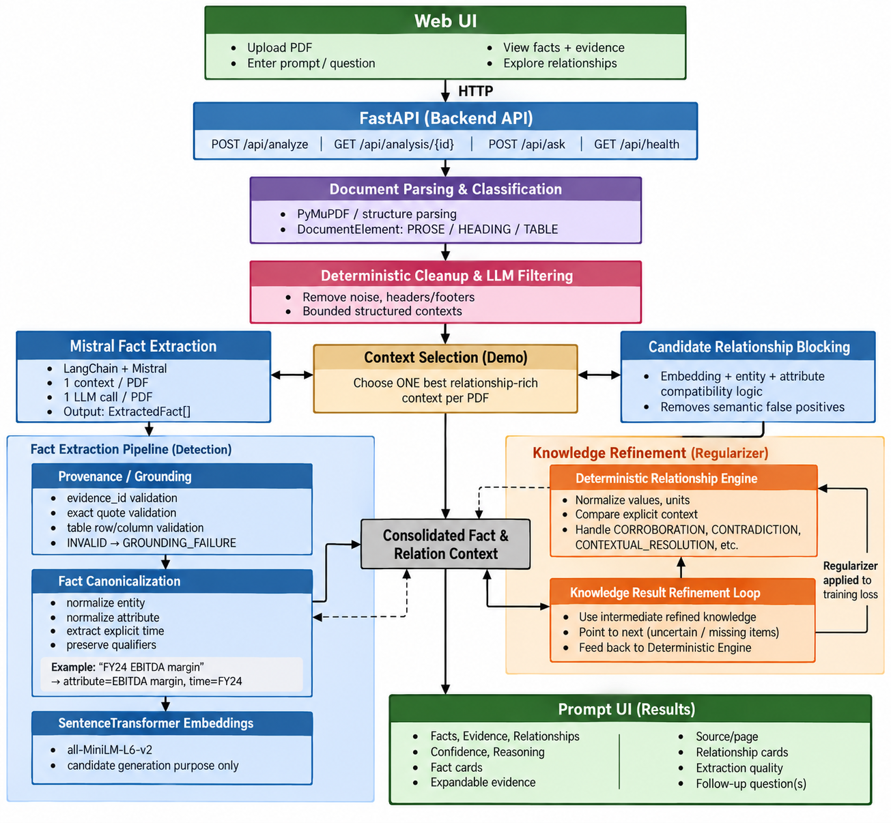
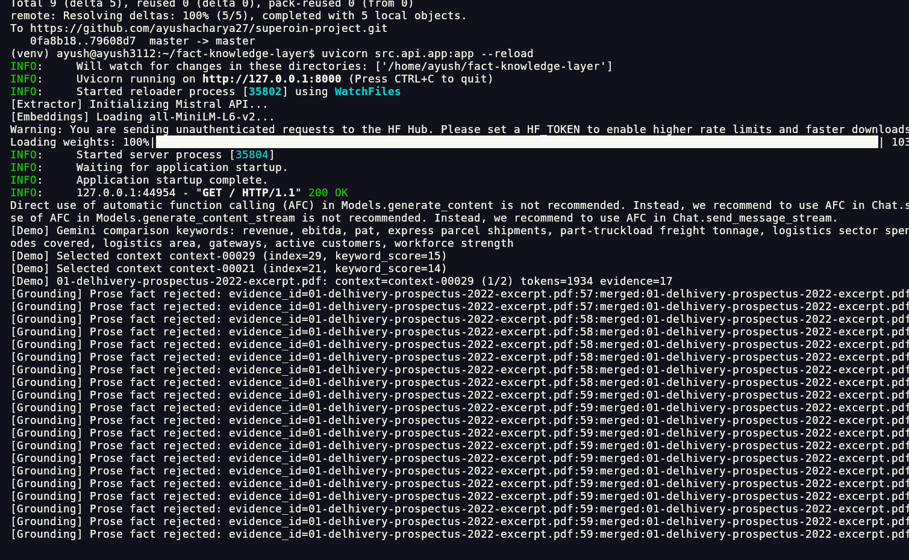
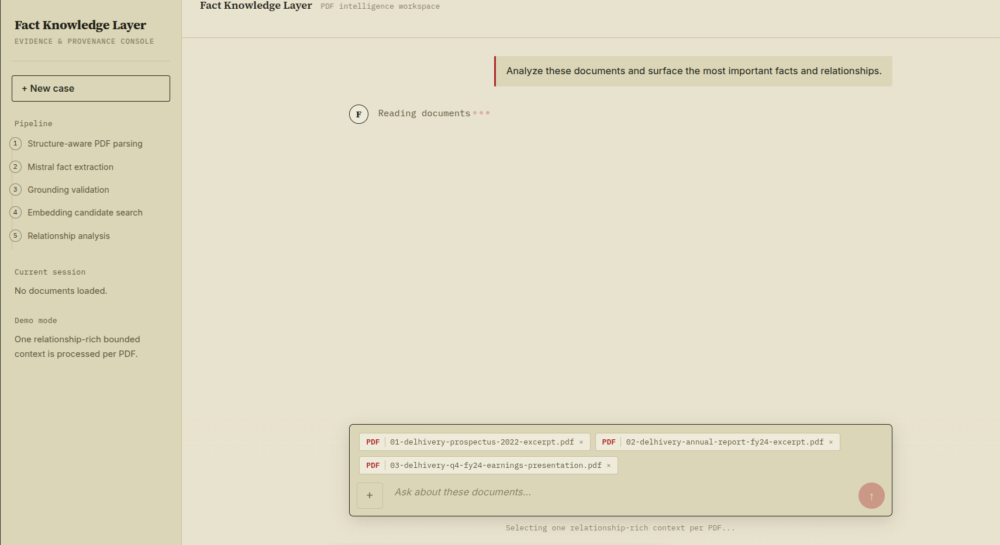
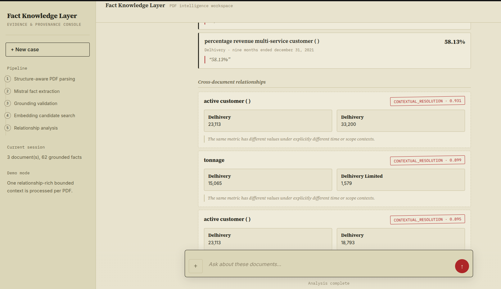

# Superjoin — Fact Knowledge Layer

<p align="center">
  
</p>

<p align="center"><strong>Evidence-grounded cross-document fact extraction and relationship reasoning</strong></p>

---

## Overview

The **Fact Knowledge Layer** turns unstructured PDF documents into a structured, evidence-backed layer of facts that can be compared across documents.

The central idea is:

> **Semantic similarity finds what might be related; evidence and context determine what the relationship means.**

Given multiple PDFs, the system:

- preserves document structure such as headings, prose, and tables
- extracts meaningful numerical and semantic facts
- links accepted facts back to source evidence
- retains time, scope, qualifiers, units, and table context where available
- finds potentially related facts across documents
- distinguishes corroboration, contradiction, contextual resolution, and uncertainty
- exposes the result through a FastAPI backend and web UI

---

## Demo

**Live application:** `<add-render-url>`

**3-minute video demo:** `<add-demo-video-link>`

The demo covers:

1. Multi-PDF upload
2. Structure-aware parsing
3. Grounded fact extraction
4. Cross-document candidate generation
5. Corroboration
6. Contradiction
7. Contextual resolution
8. Extraction/reasoning failure handling

---

## Screenshots

### System architecture



### Backend / API



### Web interface



### Extracted facts and evidence



---

# Architecture

```text
                         MULTIPLE PDFs
                              |
                              v
                +---------------------------+
                | 1. STRUCTURE-AWARE PARSER |
                | headings / prose / tables |
                | pages / rows / cells      |
                +-------------+-------------+
                              |
                              v
                +---------------------------+
                | 2. CLEANUP + FILTERING    |
                | remove document noise     |
                | preserve useful evidence  |
                +-------------+-------------+
                              |
                              v
                +---------------------------+
                | 3. BOUNDED CONTEXTS       |
                | ordered, document-local   |
                | contexts                  |
                +-------------+-------------+
                              |
                              v
                +---------------------------+
                | 4. GEMINI SEMANTIC        |
                |    SELECTION              |
                | partial evidence          |
                |        ↓                  |
                | comparison keywords       |
                +-------------+-------------+
                              |
                              v
                +---------------------------+
                | 5. CONTEXT SELECTION      |
                | rank full contexts using  |
                | semantic relevance        |
                |        ↓                  |
                | top contexts / PDF        |
                +-------------+-------------+
                              |
                              v
                +---------------------------+
                | 6. MISTRAL EXTRACTION     |
                | structured facts          |
                +-------------+-------------+
                              |
                              v
                +---------------------------+
                | 7. GROUNDING VALIDATION   |
                | fact supported?           |
                | YES -> VALID              |
                | NO  -> rejected/failure   |
                +-------------+-------------+
                              |
                              v
                +---------------------------+
                | 8. CANONICALIZATION       |
                | normalized values / units |
                | comparable fact schema    |
                +-------------+-------------+
                              |
                              v
                +---------------------------+
                | 9. EMBEDDING CANDIDATES   |
                | semantic fact identity    |
                |        ↓                  |
                | candidate pairs           |
                +-------------+-------------+
                              |
                              v
                +---------------------------+
                | 10. RELATIONSHIP ENGINE   |
                | corroboration             |
                | contradiction              |
                | contextual resolution     |
                | uncertain                 |
                +---------------------------+
```

---

## 1. Structure-aware document understanding

A PDF is not treated as one large text string.

The parser preserves useful structure including:

- page number
- headings
- prose blocks
- tables
- table headers
- table rows and cells
- table references
- positional information

This matters because the meaning of a value often comes from its surrounding structure. A table cell such as `23,113` is not meaningful by itself; its row, column, heading, page, and table context can tell us what the number represents.

---

## 2. Cleanup and filtering

PDFs contain noise such as page numbers, repeated headers, contents pages, registration information, addresses, and administrative fragments.

Deterministic cleanup and filtering happen before LLM extraction. This reduces unnecessary model input and keeps the extraction layer focused on meaningful content.

---

## 3. Bounded document contexts

Large documents are divided into ordered, bounded contexts. Contexts remain document-local and preserve table structure rather than flattening everything into plain text.

The current demo uses bounded contexts and selects the most relevant contexts before the expensive extraction step. This provides a practical trade-off between context quality, API cost, latency, and large-document handling.

---

## 4. Gemini semantic selection

Gemini is used as a **semantic selector**, not as the final fact extractor.

A partial portion of a context from each document is supplied to Gemini. Gemini identifies concise concepts that are useful for cross-document comparison.

```text
Partial evidence from PDFs
          |
          v
   Gemini semantic selector
          |
          v
 comparison-worthy keywords
```

Those keywords are then used to score the full contexts of each document, allowing the extraction stage to focus on contexts more likely to contain comparable information.

---

## 5. Mistral fact extraction

The selected contexts are passed to Mistral through **LangChain**.

The extraction model returns structured facts rather than free-form prose. A fact can contain:

```text
Entity
Attribute
Raw value
Unit
Normalized value
Time
Scope
Qualifier
Evidence ID
Source information
Extraction confidence
```

For prose evidence, the extractor is expected to return an exact supporting quote. For tables, the extraction retains table and row/column context.

---

## 6. Grounding validation

LLM output is not automatically accepted.

The grounding layer checks whether an extracted fact is actually supported by the evidence supplied to the model.

```text
LLM extraction
      |
      v
Grounding validation
   /          \
VALID       FAILURE
```

Rejected or failed extractions are kept separate from accepted grounded facts.

> **I'd rather lose a fact than manufacture evidence.**

---

## 7. Canonical facts

After grounding, valid facts are canonicalized into a consistent representation so semantically equivalent information can be compared even when documents use different textual forms.

Normalization is handled deterministically where possible, especially for numeric and unit representation.

The architecture therefore separates:

- **LLMs for semantic interpretation**
- **deterministic code for validation and normalization**

---

## 8. Embedding-based candidate generation

Canonical facts are embedded using a sentence-transformer model. The representation focuses on fact identity, including concepts such as entity, attribute, time, scope, and qualifier.

The numerical value is not treated as the primary semantic identity. This allows two facts such as `Revenue = ₹1,000 Cr` and `Revenue = ₹800 Cr` to remain potentially comparable.

Embeddings generate **candidate pairs** across documents. They do not determine whether the pair is corroborating, contradictory, or true.

---

## 9. Relationship reasoning

Candidate facts are evaluated using their structured information.

### Corroboration

Two comparable facts support the same underlying claim.

### Contradiction

Two comparable facts materially disagree.

### Contextual resolution

Two values differ, but their surrounding context explains the difference, such as different reporting periods or scopes.

### Uncertain

The facts appear semantically related, but the available evidence is insufficient to make a reliable decision.

This conservative outcome is intentional.

---

# The key architectural separation

```text
Gemini
"What concepts should I look at?"

Mistral
"What facts are present?"

Grounding
"Is that extracted fact actually supported?"

Embeddings
"What facts might correspond?"

Relationship engine
"What does that correspondence mean?"
```

This prevents a single model or similarity score from making the entire decision.

---

# API and UI

The application exposes the knowledge layer through FastAPI.

The web interface supports:

- multiple PDF upload
- analysis
- extracted fact inspection
- evidence/quote inspection
- document-level extraction statistics
- cross-document relationship inspection
- follow-up questions against the analysis

---

# Running locally

## Requirements

- Python 3.10+
- Mistral API key
- Gemini API key

## Installation

```bash
git clone <your-repository-url>
cd fact-knowledge-layer

python -m venv venv
source venv/bin/activate
```

Windows:

```bash
venv\\Scripts\\activate
```

Install dependencies:

```bash
pip install -r requirements.txt
```

Create `.env`:

```env
LLM_PROVIDER=mistral
LLM_MODEL=ministral-3b-latest
MISTRAL_API_KEY=your_mistral_key

GEMINI_API_KEY=your_gemini_key
GEMINI_MODEL=gemini-2.5-flash

EMBEDDING_MODEL=all-MiniLM-L6-v2
EMBEDDING_BATCH_SIZE=64

MAX_CONTEXT_TOKENS=2500
CHARS_PER_TOKEN=4
MAX_EVIDENCE_PER_GROUP=30

SQLITE_DB_PATH=data/facts.sqlite
```

Start the application:

```bash
uvicorn src.api.app:app --reload
```

Open:

```text
http://127.0.0.1:8000
```

---

# Render deployment

### Build command

```bash
pip install -r requirements.txt
```

### Start command

```bash
uvicorn src.api.app:app --host 0.0.0.0 --port $PORT
```

### Health check

```text
/health
```

API keys should be configured as Render environment variables.

**Never commit `.env` or API keys to GitHub.**

---

# Project structure

```text
fact-knowledge-layer/
│
├── data/
│   └── starter_pdfs/
│
├── src/
│   ├── api/
│   │   └── app.py
│   ├── db/
│   ├── llm/
│   │   ├── extractor.py
│   │   └── semantic_selector.py
│   ├── matcher/
│   │   ├── embeddings.py
│   │   └── resolve.py
│   ├── pipeline/
│   │   ├── document_structure.py
│   │   ├── document_cleanup.py
│   │   ├── document_chunking.py
│   │   ├── llm_filter.py
│   │   └── canonicalizer.py
│   └── schemas/
│
├── config.py
├── requirements.txt
├── README.md
└── .env
```

---

# Design constraints

The implementation is designed to generalize to new documents.

There are no document-specific fact lists, fixed filenames, or hardcoded Delhivery metrics driving the pipeline. Document structure, evidence, semantic selection, extraction, grounding, and relationship layers operate on the content provided at runtime.

---

# Limitations

### PDF layout variability

Extraction quality can vary between documents. Complex tables, unusual layouts, scanned pages, and visually positioned content can require more specialized parsing.

### LLM extraction failures

Structured LLM output can occasionally be malformed or ambiguous. Grounding validation reduces the impact of these failures, but does not eliminate model errors.

### API latency and cost

The pipeline intentionally bounds the amount of content sent to the LLMs. Processing several PDFs can still take noticeable time because semantic selection and fact extraction require model calls.

### Relationship ambiguity

Some facts are genuinely difficult to compare automatically. Highly similar metric names can still refer to values with different units, periods, or scopes. The system therefore allows an `UNCERTAIN` outcome instead of forcing a conclusion.

### Current storage

SQLite is sufficient for the demo and small workloads. A larger production deployment could use a dedicated database and scalable vector infrastructure.

---

# Next steps

Potential production improvements include:

- incremental PDF processing
- content-hash based caching
- cached LLM extraction results
- stronger OCR/scanned-document handling
- improved table reconstruction
- richer temporal and scope normalization
- a dedicated second-stage reasoning model for ambiguous relationships
- scalable vector storage for large fact collections
- asynchronous job processing for long-running PDF analysis
- stronger evaluation datasets and relationship-level metrics
- idempotent re-ingestion using stable document/fact identifiers

---

# Additional notes

## Why not send the whole PDF to an LLM?

Because it is expensive, slow, and makes provenance harder to control.

The system instead narrows the search space:

```text
whole PDF
   ↓
structured elements
   ↓
bounded contexts
   ↓
semantic selection
   ↓
relevant contexts
   ↓
fact extraction
```

## Why use two LLMs?

The models have different responsibilities. Gemini performs semantic selection, while Mistral performs structured fact extraction. This keeps the pipeline modular and avoids asking one model to search and extract everything.

## Why embeddings?

Two documents may describe the same metric using different wording. Embeddings help discover these semantic candidates. They cannot, by themselves, determine whether different values are caused by time, scope, units, or a genuine contradiction.

> **Embeddings generate candidates. They do not decide relationships.**

## Why preserve evidence?

Because a knowledge layer without provenance is difficult to trust. Every accepted fact should be traceable back to the document evidence that produced it.

---

# Demo cases

The application is designed to demonstrate four important cross-document scenarios:

| Case | Meaning |
|---|---|
| **Corroboration** | Two comparable facts support the same claim |
| **Contradiction** | Comparable facts materially disagree |
| **Contextual resolution** | Different values are explained by time, scope, or other context |
| **Uncertain / failure** | Evidence is insufficient or extraction cannot be safely validated |

The fourth case is particularly important: the system should expose uncertainty instead of manufacturing confidence.

---

# Technology

- **Python**
- **FastAPI**
- **PyMuPDF / PyMuPDF4LLM**
- **Pydantic**
- **LangChain**
- **Mistral / Ministral**
- **Google Gemini**
- **Sentence Transformers**
- **NumPy**
- **scikit-learn**
- **SQLite**
- **HTML / CSS / JavaScript**

---

## Core principle

> **Build facts from evidence first. Compare facts second. Reason about relationships last.**
